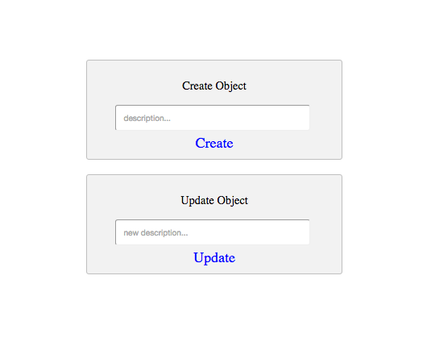

# starterTemplate-Create-Update-Object-API
a starter template for creating and updating objects using the Stamplay Rest API

**CLONING: When cloning this repo, you must initialize your app to make it work.**

 1) **Initialize the front-end of your app with Stamplay**
 <br>
- Go to your command line and enter **stamplay init**
- When prompted, enter your **appID** & **API Key**

2) **Configure object model**
- Go to your Stamplay editor and select **Objects**, then click **Add+**
- Give **object model** a name (e.g "object")
- Create properties on that model with a property **name** and value **type** (e.g Name:"description" Type:"String")

4) **Create Object**
```
function createObject(){
	var description = document.getElementById('createData').value;

	var data = JSON.stringify({
  	"description": description
	});

	var xhr = new XMLHttpRequest();
	xhr.withCredentials = true;

	xhr.addEventListener("readystatechange", function () {
  		if (this.readyState === this.DONE) {
    		console.log(this.responseText);
  		}
	});

	xhr.open("POST", "https://[yourAppId].stamplayapp.com/api/cobject/v1/:cobjectId");
	xhr.setRequestHeader("accept", "application/json");
	xhr.setRequestHeader("content-type", "application/json");
	xhr.send(data);
}
```
5) **Update Object**
```
function updateObject(){

	var newDescription = document.getElementById('updateData').value;

	var data = JSON.stringify({
  	"description": newDescription
	});

	var xhr = new XMLHttpRequest();
	xhr.withCredentials = true;

	xhr.addEventListener("readystatechange", function () {
  		if (this.readyState === this.DONE) {
    		console.log(this.responseText);
  		}
	});

	xhr.open("PUT", "https://[yourAppId].stamplayapp.com/api/cobject/v1/cobjectId/:id");
	xhr.setRequestHeader("accept", "application/json");
	xhr.setRequestHeader("content-type", "application/json");
	xhr.send(data);
}
```


